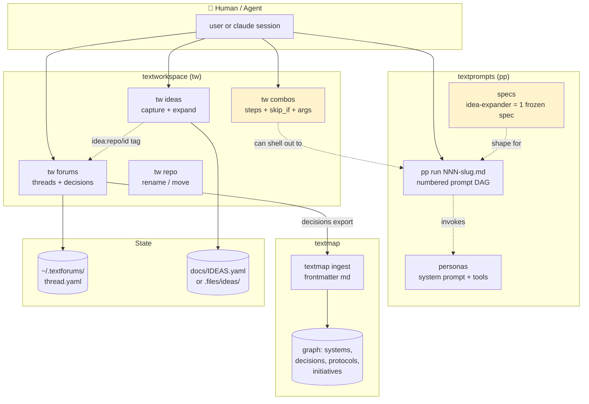
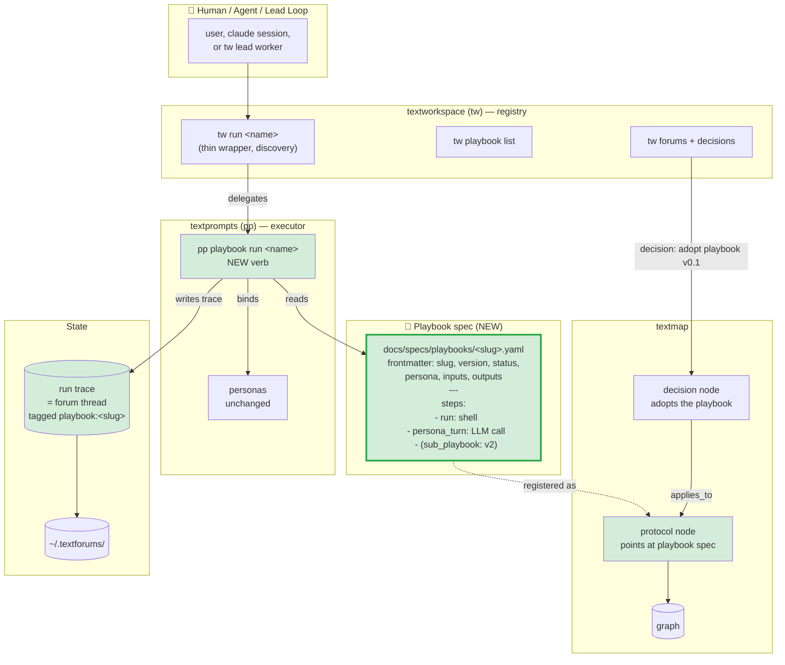

# Playbook format — current vs proposed flow

## Today (what exists)

**What's missing (the gap):**
- `tw combos` is shell-step automation, no persona binding, no I/O contract, no freeze.
- `idea-expander` is a one-off spec, not a generic shape.
- No first-class artifact for "an agent action sequence" that textmap can point at as a `protocol`.
- Lead loop (`tw-lead-loop` brainstorm) has nothing concrete to dispatch.

---

## Proposed v1 — playbook as the missing primitive

**What changes:**

| Layer | Before | After v1 |
|---|---|---|
| Action sequence | `tw combos` (shell) OR ad-hoc prompt files | **playbook spec** (typed, versioned, frozen on adopt) |
| Persona binding | Implicit in prompt files | Explicit `persona: <slug>` in frontmatter |
| I/O contract | None | `inputs:` + `outputs:` declared, validated |
| Run trace | Scattered (logs, ad-hoc) | Forum thread tagged `playbook:<slug>` |
| textmap link | None | `protocol` node per playbook; `decision` node when adopted |
| CLI surface | Overloaded `pp run` | Split: `pp playbook run` (executor) / `tw run` (registry) |

---

## What v1 explicitly does NOT include

- ❌ Branches / loops (only `skip_if` + sequential steps)
- ❌ `sub_playbook` composition
- ❌ Runtime output-shape validation (static JSON Schema only)
- ❌ Fused persona-as-playbook (kept orthogonal)
- ❌ Auto-ingestion into textmap (one-shot export, like decisions today)

These all have hooks left in the schema, but they ship in v2 once the v1 shape is exercised.

---

## The smallest first playbook (proof point)

`triage-stale-pr` — see strawman in PROMPT-playbook-format.md. Three steps:
1. `run: gh pr view` — fetch PR data
2. `persona_turn:` — LLM decides close/ping/leave
3. `run: textforums new` — post the verdict thread

If this one playbook works end-to-end (frozen spec → `pp playbook run` → thread trace → textmap protocol node), the format is validated. Everything else is iteration.
